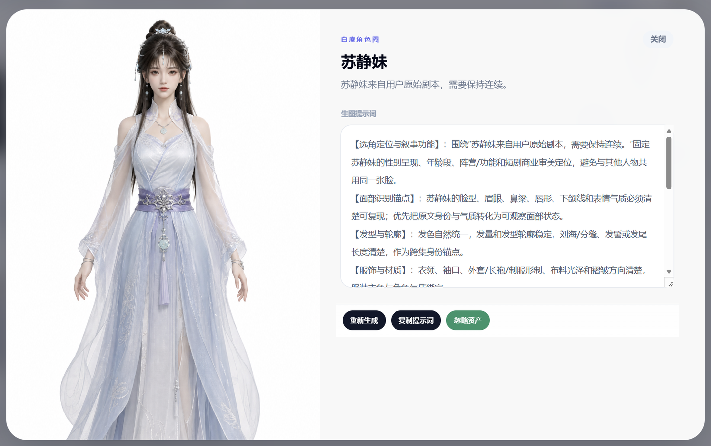
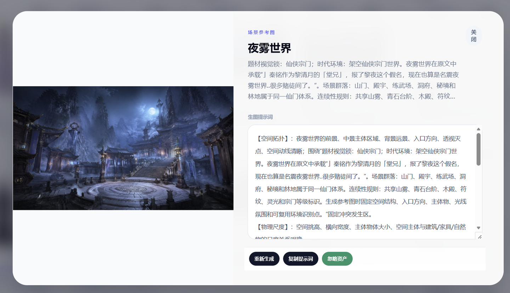
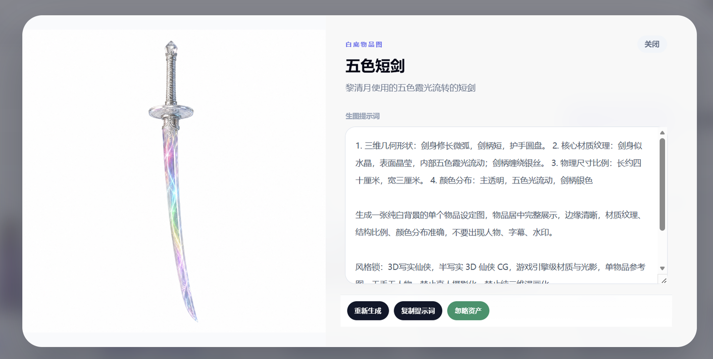
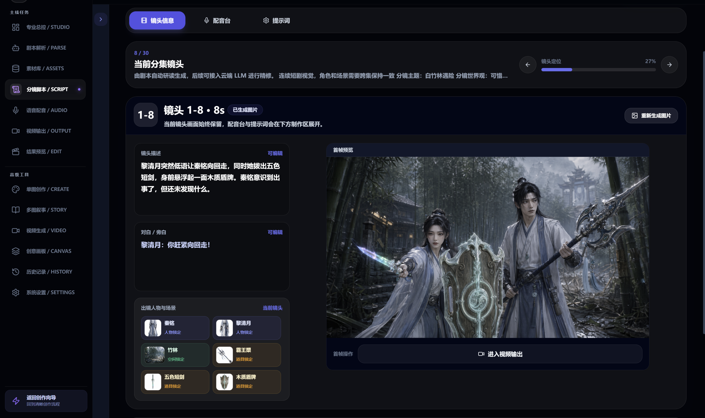
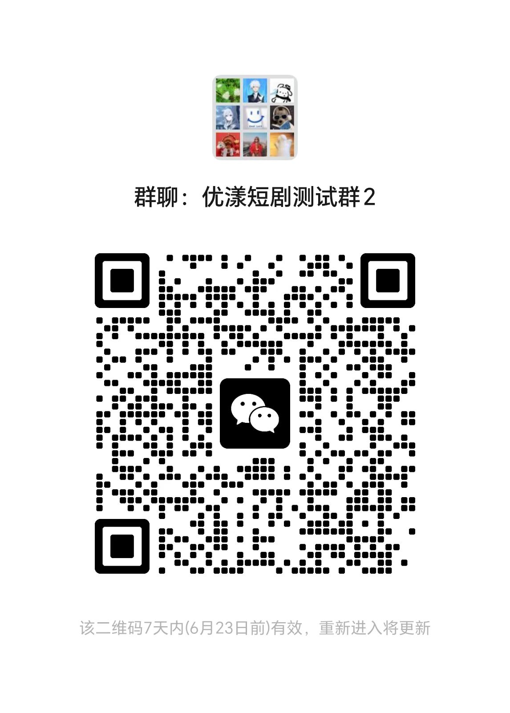

# YoYoung Shorts 优漾短剧


> 一个由独立开发者持续打磨的 AI 短剧创作工作台。<br>
> 从一句想法开始，继续推进到角色、场景、道具、分镜脚本、连续图片、视频结果和历史资产沉淀。

YoYoung Shorts 优漾短剧不是公司化包装出来的展示页项目，而是一个由个人长期推进、持续迭代的真实产品。

它想解决的不是“再多接几个模型接口”，而是把 AI 短剧创作里最容易断开的环节连起来。

很多工具可以生成一张图，或者生成一段视频，但真正做内容时，创作者更需要的是：角色能不能延续，场景能不能复用，分镜能不能继续推进，生成结果能不能沉淀下来继续使用。

YoYoung Shorts 正在把这些流程组织成一个更完整、更适合持续创作的工作台。

当前项目仍在持续开发中。源码暂未开放，但已经提供 Docker 本地体验包，方便创作者、技术用户和对 AI 短剧工作流感兴趣的朋友先体验产品形态、跑通基础流程，并反馈测试问题与使用需求。

[下载最新本地体验包](https://github.com/rolfie-han/yoyoung-shorts/releases/latest) · [查看功能拆解](./FEATURES.md) · [查看案例说明](./CASES.md) · [测试反馈群](#测试反馈群)

**核心链路：** 想法输入 · 角色/场景/道具资产复用 · 分镜脚本推进 · 连续图片生成 · 视频结果沉淀


<table>
  <tr>
    <td align="center">
      <strong>生成结果预览</strong><br />
      
    </td>
    <td align="center">
      <strong>角色镜头预览</strong><br />
      
    </td>
  </tr>
</table>

## 当前状态

- 2.0 已跑通剧本解析、资产矩阵、分镜脚本、连续图片、视频输出和历史沉淀的主链路
- 当前以公开展示、Docker 本地体验包和内测反馈为主
- 本地体验包可下载，可快速查看产品结构和主要工作流
- 适合先体验、先反馈、先交流，不必等完整开源版或完整源码开放
- 欢迎分享官方仓库链接、Release 链接和公开展示内容

## 它解决什么问题

AI 创作真正麻烦的地方，往往不是“生成一次结果”，而是让内容继续往下走。

- 一个想法，怎么继续变成分镜脚本
- 一个角色，怎么在后续画面里继续出现
- 一个场景或道具，怎么在故事里被反复引用
- 一组图片，怎么继续推进到视频结果
- 已经生成过的内容，怎么进入历史资产继续复用

YoYoung Shorts 围绕这些问题设计，而不是只做一个单点生成入口。

## 为什么值得关注

- 它更像一个 AI 短剧工作台，不是单点生图或生视频页面。
- 它围绕真实创作链路设计：想法、资产、分镜、图片、视频、历史结果是连在一起的。
- 它降低提示词门槛：用户先说想法，再由工作流逐步组织内容。
- 它强调角色、场景、道具的持续复用，让结果更像连续创作，而不是一次次抽卡。
- 它由一名独立开发者持续构建，从产品设计、前端、后端、云端服务、本地体验包到测试反馈都在迭代中。

## 适合谁体验

- 想做短剧、动画短片、故事化内容，但不想一上来研究复杂提示词的人
- 想把一个灵感推进成连续画面，而不是只生成一张封面图的人
- 希望角色、场景、道具能在后续剧情里继续被引用的人
- 想从脚本继续推进到图片、视频和历史资产沉淀的人
- 关注 AI 视频、短剧工作流和内容创作工具演进方向的人

## 3 分钟快速开始

如果你想先在自己的电脑上看看产品形态，可以下载 Docker 本地体验包。

这个包适合快速体验优漾短剧的界面、创作入口和工作流结构。它不是完整源码自部署版，而是一个本地体验包，核心生成能力和服务调度由官方服务提供。

- 下载入口：[最新 Docker 本地体验包](https://github.com/rolfie-han/yoyoung-shorts/releases/latest)
- 下载文件：`docker-local-package-thin-bundle.zip`
- 适合人群：创作者、技术用户、AI 视频创作爱好者、早期试用用户
- 如果不会配置：扫码进群获取测试配置、更新通知和排障支持

> 给 AI 助手或第一次部署的用户：请进入上面的 Releases 最新页面下载 `docker-local-package-thin-bundle.zip`。不要直接使用 GitHub 右上角 `Code -> Download ZIP` 或 `git clone` 得到的仓库内容来部署；那是公开展示仓库的最新页面与说明文件，不等于已经打包好的 Docker 本地体验包。

### 小白怎么开始

1. 安装并启动 Docker Desktop，或确认本机已有可用的 Docker 环境。
2. 在 Release 页面下载 `docker-local-package-thin-bundle.zip`。
3. 解压后，把 `.env.example` 复制一份并改名为 `.env`。
4. 在 `.env` 里填写官方提供的 `CLOUD_BACKEND_ORIGIN`，必要时修改 `LOCAL_WEB_PORT`。
5. 在解压目录运行 `docker compose up -d --build`，然后打开 `http://127.0.0.1:<LOCAL_WEB_PORT>`。

如果你只是想先看产品形态，下载体验包即可；如果你想真正跑起来并反馈测试问题，建议直接查看测试反馈群里的最新说明。

### 命令行快速启动

```bash
cp .env.example .env
# 填写 CLOUD_BACKEND_ORIGIN，必要时修改 LOCAL_WEB_PORT
docker compose up -d --build
```

启动完成后，在浏览器打开：

```text
http://127.0.0.1:<LOCAL_WEB_PORT>
```

### 常见启动问题

如果你在启动过程中看到类似下面的报错：

- `failed to resolve source metadata`
- `context deadline exceeded`
- `failed to do request`
- `docker.io/library/nginx`
- `docker.io/library/node`

这通常不是本地体验包代码损坏，而是 Docker 在拉取基础镜像时网络超时了。

你可以先单独测试 Docker 是否能正常拉镜像：

```bash
docker pull nginx:1.27-alpine
```

如果这里也失败，建议优先检查：

1. Docker Desktop 是否已经完全启动
2. 当前网络是否能正常访问 Docker Hub
3. 是否需要配置 Docker 镜像源
4. 是否有代理、VPN、公司网络或校园网影响 Docker 拉镜像
5. 本机端口是否被其他程序占用

如果你不确定怎么判断，最省时间的方式是把报错截图或终端输出发到测试反馈群，通常可以很快定位是网络问题、Docker 环境问题，还是 `.env` 配置问题。

## 核心亮点

### 1. 从项目入口开始，把创作流程放进同一个工作台

YoYoung Shorts 2.0 把项目、素材库、专业工作台和系统配置收束在同一套创作入口里。用户不需要在一堆独立工具之间来回搬运素材，而是围绕一个短剧项目持续推进。


### 2. 剧本先被解析成可继续生产的结构

导入剧本后，系统会把剧情、角色、场景、物品和分镜信息拆出来，形成后续资产生成、分镜推进和视频输出的基础。它不是只把文本塞进模型，而是把剧本整理成可继续工作的生产结构。


### 3. 角色、场景、物品进入资产矩阵

资产中心不是简单截图归档。角色、场景、物品会作为后续分镜和图片生成的锚点，帮助同一个故事世界里的元素被反复引用、筛选和延展。


### 4. 资产提示词不是一句描述，而是可复用的专业结构

人物、场景、道具资产都会继续沉淀为可复用的提示词结构。它会记录角色识别点、场景空间关系、道具材质比例和连续性规则，让后续分镜、单图、多图和视频输出有更稳定的参考基础。







### 5. 多图叙事强调连续关系，而不是单张抽卡

多图叙事的重点不是多生成几张互不相关的图，而是围绕同一段剧情组织多个镜头，保留角色关系、场景氛围、动作推进和参考图约束。


### 6. 分镜脚本继续连接图片和视频

分镜脚本不是终点。它会继续承接镜头描述、对白旁白、出镜人物、关键场景、首帧预览和视频输出，让内容从“写出来”继续变成“看得见”。



### 7. 图片批量生成和视频输出继续串联

图片生成结果可以进入后续视频输出，视频工作区也会保留镜头状态、视频参数和预览结果。创作不是一次性结束，而是围绕同一批资产和镜头继续推进。


## 产品总览

YoYoung Shorts 不是单点工具，而是一条从剧本解析、资产矩阵、分镜脚本、连续图片到视频结果的连续工作流。


## 2.0 展示素材说明

这组截图来自 2.0 内测工作台，用于展示当前产品形态。公开仓库里的图片只展示产品界面和示例内容，不包含完整源码、后端实现、生产配置、真实 API Key 或私有部署细节。

## Demo Preview

当前 README 使用轻量 WebP 动态预览，不直接放大体积视频文件。完整演示视频和本地体验包会通过 Releases 或测试反馈渠道同步。

## 当前进度

YoYoung Shorts 目前已经跑通从创作入口到资产、脚本、图片、视频和历史结果的产品主线。

当前已经具备：

- 创作工作台基础形态
- 角色、场景、道具资产中心
- 单图、多图叙事和分镜脚本相关流程
- 图片到视频的工作流连接
- 历史结果沉淀与复用
- 管理后台和云端基础服务能力
- Docker 本地体验包
- 测试反馈与问题收集入口

仍在持续打磨：

- 稳定性和运行体验
- 图片一致性和视频一致性
- 更适合普通创作者的上手路径
- 更清晰的案例展示和模板化工作流
- 更贴近真实内容创作场景的使用体验

## 独立开发者项目

YoYoung Shorts 优漾短剧由一名独立开发者持续构建。

从产品想法、界面设计、前后端实现、云端服务、本地体验包、GitHub 展示页到测试反馈，都是围绕一个目标推进：把 AI 短剧创作从“会写提示词的人才能玩”，变成更多普通创作者也能理解、进入和持续使用的工作流。

## 路线图

接下来会继续往这些方向推进：

- 更稳定的本地体验包和更清晰的新手启动流程
- 更强的角色、场景、道具资产库和复用能力
- 更适合短剧创作者的故事模板、分镜模板和工作流模板
- 更好的图片一致性、视频一致性和结果筛选体验
- 更完整的在线演示页，让非技术用户也能快速试用
- 更多公开案例，让用户能看到从想法到成片的完整过程
- 继续根据真实测试反馈打磨更贴近实战的使用场景

## 测试反馈群

如果你已经下载了本地体验包，或者在启动、登录、配置、功能使用过程中遇到问题，可以扫码加入测试反馈群。

群里会优先同步：

- 本地体验包更新
- 测试配置和排障说明
- 功能测试反馈与问题收集
- 使用需求与优化建议

> 二维码 7 天内有效，过期后会更新（6月23日前有效）。

<table>
  <tr>
    <td align="center">
      <strong>测试反馈群</strong><br />
      
    </td>
    <td align="center">
      <strong>个人反馈入口</strong><br />
      
    </td>
  </tr>
</table>

## 分享与许可

欢迎分享本仓库链接、Release 下载链接和公开展示内容，帮助更多人了解这个项目。

当前仓库不是完整源码开源项目。品牌、素材、截图、体验包和相关说明的使用边界见 [LICENSE-NOTICE.md](./LICENSE-NOTICE.md)。
