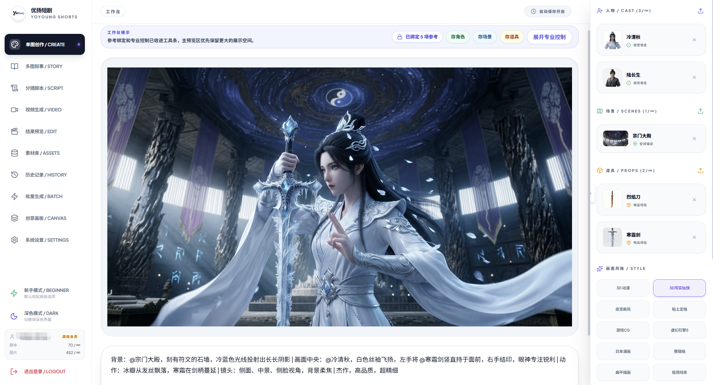
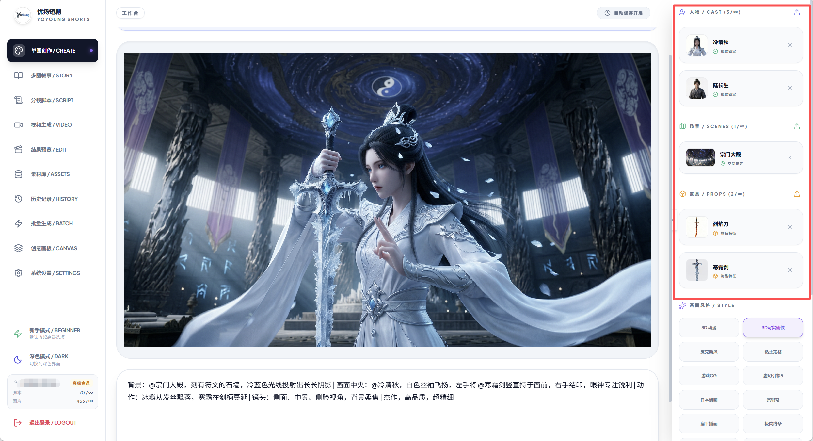
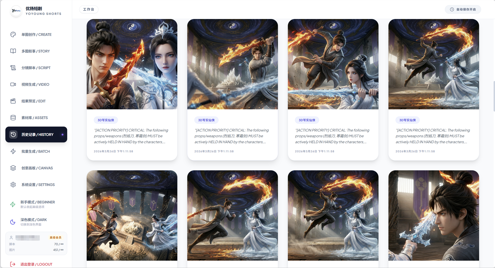
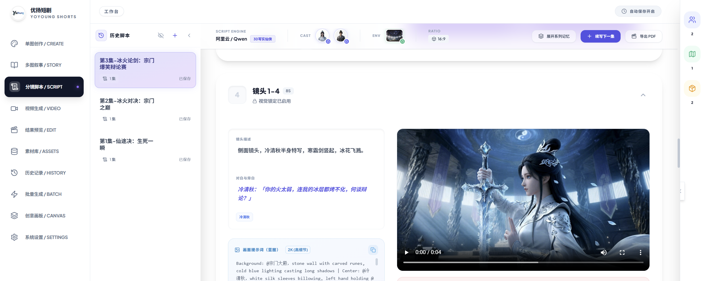
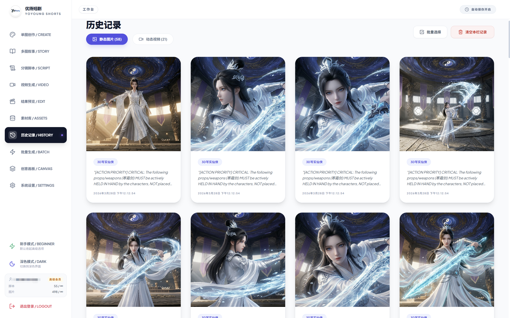
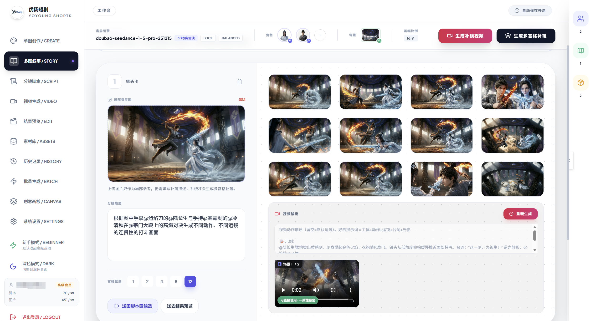
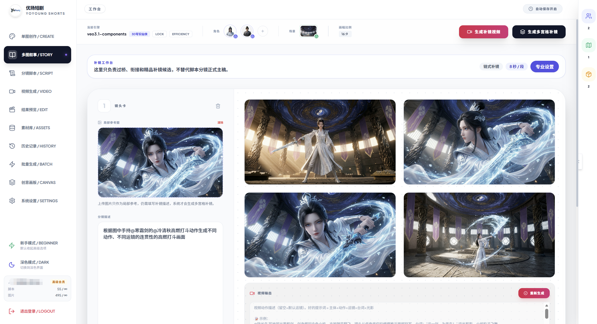
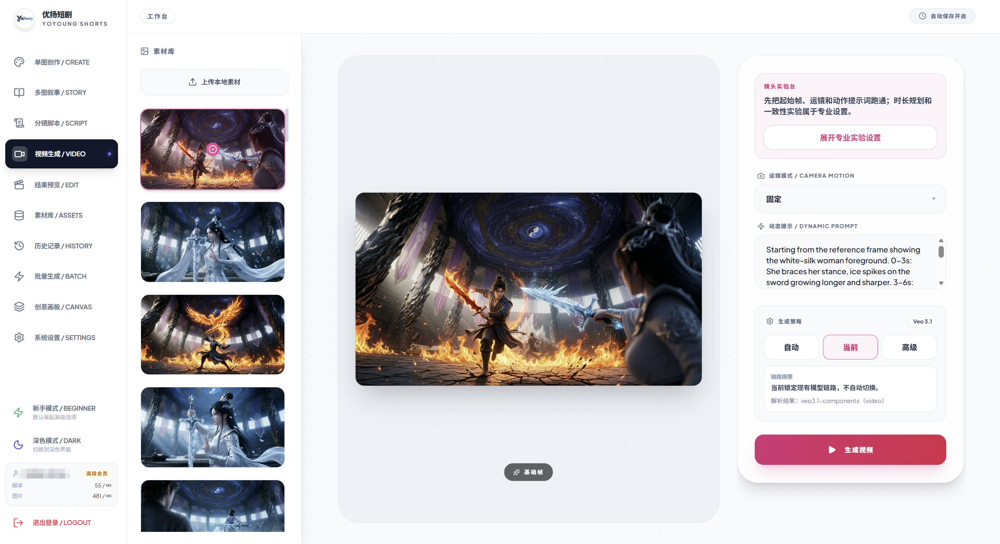

# YoYoung Shorts 优扬短剧

> 一个由独立开发者从 0 到 1 持续打磨的 AI 短剧创作工作台。 
> 从一句想法开始，继续推进到角色、场景、道具、分镜脚本、连续图片、视频结果和历史资产沉淀。

YoYoung Shorts 优扬短剧不是“套几个模型接口的壳”，而是一套围绕真实创作流程组织出来的 AI 短剧工作台。它希望解决的不是“让用户学会写更复杂的提示词”，而是让更多创作者可以从一个想法出发，一步一步把故事组织成可继续延展的图像和视频结果。

当前项目还在早期打磨阶段。源码暂不开放，但已经提供 Docker 本地体验包，方便技术用户、早期试用用户和潜在合作方先看产品形态、跑一跑体验流程、进群反馈问题。

[下载本地体验包](https://github.com/rolfie-han/yoyoung-shorts/releases/tag/v0.1.1-docker-thin-public-clean) · [查看功能拆解](./FEATURES.md) · [查看案例说明](./CASES.md) · [加入测试群](#加入测试群)

## 为什么值得关注

- 它更像一个“AI 短剧工作台”，不是单点生图/生视频页面。
- 它围绕真实创作链路设计：想法、资产、分镜、图片、视频、历史结果是连在一起的。
- 它降低提示词门槛：用户先说想法，再由工作流逐步组织内容，而不是先学提示词工程。
- 它强调角色、场景、道具的持续复用，让结果更像连续创作，而不是一次次抽卡。
- 它由一名独立开发者完整推进，从产品设计、前端、后端、部署、体验包到测试群都在持续迭代。

## 适合谁来体验

- 想做短剧、动画短片、故事化内容，但不想一上来研究复杂提示词的人。
- 想把一个灵感推进成连续画面，而不是只生成一张封面图的人。
- 希望角色、场景、道具能在后续剧情里继续被引用的人。
- 想从脚本继续推进到图片、视频、历史资产沉淀的人。
- 正在寻找 AI 视频工具、短剧工作流、内容生产工具合作方向的团队或个人。

## 下载本地体验包

如果你想先在自己的电脑上看看产品形态，可以下载 Docker 本地体验包。

这个包适合用来快速体验优扬短剧的界面、创作入口和工作流结构。它不是完整源码自部署版，而是一个本地体验包 / 技术预览包，核心生成能力、服务调度和商业后端由官方服务提供。

- 下载入口：[v0.1.1 Docker Thin 本地软件包](https://github.com/rolfie-han/yoyoung-shorts/releases/tag/v0.1.1-docker-thin-public-clean)
- 下载文件：`docker-local-package-thin-bundle.zip`
- 适合人群：创作者、技术用户、合作方、早期试用用户
- 如果不会配置：扫码进群获取测试配置、更新通知和排障支持

### 小白怎么开始

1. 安装并启动 Docker Desktop，或确认本机已有可用的 Docker 环境。
2. 在 Release 页面下载 `docker-local-package-thin-bundle.zip`。
3. 解压后，把 `.env.example` 复制一份并改名为 `.env`。
4. 在 `.env` 里填写官方提供的 `CLOUD_BACKEND_ORIGIN`，必要时修改 `LOCAL_WEB_PORT`。
5. 在解压目录运行 `docker compose up -d --build`，然后打开 `http://127.0.0.1:<LOCAL_WEB_PORT>`。

如果你只是想先了解产品能力，可以继续看下面的截图、案例和演示视频；如果你想实际跑起来，建议先下载体验包，再进测试群获取最新说明。

## 核心亮点

### 1. 从一句想法开始，而不是从复杂提示词开始

很多 AI 创作工具默认用户已经会写提示词。YoYoung Shorts 更希望用户先说清楚“想做什么”，再由产品把想法继续组织成图片、脚本和视频相关流程。

### 2. 角色、场景、道具不是摆设，而是创作锚点

资产中心不是简单归档。角色、场景、道具会持续参与后续生成，让同一个故事世界里的元素可以被再次引用和延展。

### 3. 多图叙事强调连续关系，而不是重复抽图

多图叙事的重点不是“多生成几张图”，而是把同一个剧情段落组织成连续画面，保留角色关系、场景氛围和动作推进感。

### 4. 分镜脚本可以继续连接图片和视频

分镜脚本不是终点。它可以继续承接图片、镜头描述和视频生成，让内容从“写出来”继续变成“看得见”。

### 5. 历史结果可以沉淀和复用

图片和视频结果会进入历史记录，方便回看、比较、筛选和继续延展。创作不是一次性结束，而是可以继续生长。

## 产品总览

这张总览图能说明它的整体方向：YoYoung Shorts 不是单点工具，而是一条从多图叙事推进到视频结果的连续工作流。

## 视频与音频工作区

产品不只停留在单一结果页，而是继续把脚本、视频、音频和历史结果串联起来，让创作者有继续编辑和复用的空间。

## Demo Videos

短视频比 GIF 更适合展示连续工作流。GitHub 对 mp4 内联预览支持不总是理想，所以这里把视频作为补充演示材料，核心说明仍然放在截图和文字结构里。

- [一句想法 -> 分镜脚本](./assets/videos/demo-idea-to-script.mp4)
- [资产中心 -> 多图叙事](./assets/videos/demo-assets-to-story.mp4)
- [分镜脚本 -> 视频结果](./assets/videos/demo-script-to-video.mp4)

## 当前进度

YoYoung Shorts 目前处在早期体验和持续打磨阶段，已经跑通了一条从创作入口到资产、脚本、图片、视频和历史结果的产品主线。

当前已经具备：

- 创作工作台基础形态
- 角色、场景、道具资产中心
- 单图、多图叙事和分镜脚本相关流程
- 图片到视频的工作流连接
- 历史结果沉淀与复用
- 管理后台和云端服务基础能力
- Docker 本地体验包
- 测试群反馈和早期用户交流入口

还在继续打磨：

- 稳定性和运行体验
- 图片一致性和视频一致性
- 更适合普通创作者的上手路径
- 更清晰的案例展示和模板化工作流
- 更适合商用团队试用的交付方式

## 独立开发者项目

YoYoung Shorts 优扬短剧由一名独立开发者持续构建。

从产品想法、界面设计、前后端实现、云端部署、本地体验包、GitHub 展示页到测试群反馈，都是围绕一个目标推进：把 AI 短剧创作从“会写提示词的人才能玩”，变成更多普通创作者也能理解、进入和持续使用的工作流。

这也是为什么它不会只停留在“接一个模型接口”上，而是会继续关注角色资产、剧情结构、分镜表达、视频结果、历史复用和真实创作体验。

## Roadmap

接下来会继续往这些方向推进：

- 更稳定的本地体验包和更清晰的新手启动流程
- 更强的角色、场景、道具资产库和复用能力
- 更适合短剧创作者的故事模板、分镜模板和工作流模板
- 更好的图片一致性、视频一致性和结果筛选体验
- 更完整的在线演示页，让非技术用户也能快速试用
- 更多公开案例，让用户能看到从想法到成片的完整过程
- 面向团队、工作室、MCN、内容账号的合作试用和定制探索
- 后续视产品成熟度，开放部分基础能力展示版给社区

## 合作方向

如果你正在做短剧、AI 视频、内容账号、MCN、自动化内容生产、工具分发或私有化交付，可以进群交流。

目前更适合这些合作方向：

- AI 短剧创作流程试用
- 内容团队内部效率工具探索
- AI 视频工具链集成讨论
- 创作者案例共建
- 产品体验反馈和早期用户共创
- 商单、定制、部署和合作机会沟通

## 加入测试群

如果你已经下载了本地体验包，或者想先看看后续更新、反馈体验问题，可以扫码加入测试群。

群里会优先同步：

- 本地体验包更新
- 测试配置和排障说明
- 新功能演示和测试反馈
- 后续体验名额和合作交流信息

> 二维码 7 天内有效，过期后会更新。

## License Notice

这个仓库用于展示 YoYoung Shorts 优扬短剧的产品能力、案例和体验包入口。当前不是完整源码开源项目。品牌、素材、截图、体验包和相关说明的使用边界见 [LICENSE-NOTICE.md](./LICENSE-NOTICE.md)。
